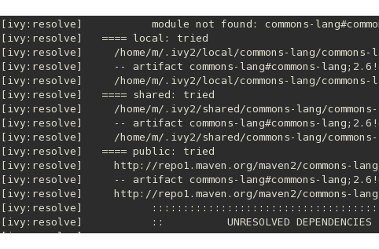

# Apache Ivy Resolvers and Repository

<!-- TOC -->

- [1. Apache Ivy Repositories](#1-apache-ivy-repositories)
- [2. Apache Ivy Resolvers](#2-apache-ivy-resolvers)
  - [2.1. Ivy Built-in Resolvers](#21-ivy-built-in-resolvers)
  - [2.2. Apache Ivy Resolvers Examples](#22-apache-ivy-resolvers-examples)
  - [2.3. Apache Ivy Default Resolvers](#23-apache-ivy-default-resolvers)
  - [2.4. Clearing the Cache](#24-clearing-the-cache)

<!-- /TOC -->

## 1. Apache Ivy Repositories

The Default configuration of Ivy allows following types of repository.

- **Public** – repositories available publicly in Internet
- **Local** – private repository, access is restricted to the user
- **Shared** – a common repository shared between the members of a team

Default settings of these repositories are defined by Ivy in its own `ivysettings.xml` which is packaged within the `ivy.jar`(`org/apache/ivy/core/settings/ivysettings.xml`).

File: `ivysettings.xml`

```xml
<ivysettings>
    <settings defaultResolver="default"/>
    <include url="${ivy.default.settings.dir}/ivysettings-public.xml"/>
    <include url="${ivy.default.settings.dir}/ivysettings-shared.xml"/>
    <include url="${ivy.default.settings.dir}/ivysettings-local.xml"/>
    <include url="${ivy.default.settings.dir}/ivysettings-main-chain.xml"/>
    <include url="${ivy.default.settings.dir}/ivysettings-default-chain.xml"/>
</ivysettings>
```

File: `ivysettings-public.xml`

```xml
<ivysettings>
    <resolvers>
        <ibiblio name="public" m2compatible="true"/>
    </resolvers>
</ivysettings>
```

File: `ivysettings-shared.xml`

```xml
<ivysettings>
    <property name="ivy.shared.default.root"             value="${ivy.default.ivy.user.dir}/shared" override="false"/>
    <property name="ivy.shared.default.ivy.pattern"      value="[organisation]/[module]/[revision]/[type]s/[artifact].[ext]" override="false"/>
    <property name="ivy.shared.default.artifact.pattern" value="[organisation]/[module]/[revision]/[type]s/[artifact].[ext]" override="false"/>
    <resolvers>
        <filesystem name="shared">
            <ivy pattern="${ivy.shared.default.root}/${ivy.shared.default.ivy.pattern}" />
            <artifact pattern="${ivy.shared.default.root}/${ivy.shared.default.artifact.pattern}" />
        </filesystem>
    </resolvers>
</ivysettings>
```

File: `ivysettings-local.xml`

```xml
<ivysettings>
    <property name="ivy.local.default.root"             value="${ivy.default.ivy.user.dir}/local" override="false"/>
    <property name="ivy.local.default.ivy.pattern"      value="[organisation]/[module]/[revision]/[type]s/[artifact].[ext]" override="false"/>
    <property name="ivy.local.default.artifact.pattern" value="[organisation]/[module]/[revision]/[type]s/[artifact].[ext]" override="false"/>
    <resolvers>
        <filesystem name="local">
            <ivy pattern="${ivy.local.default.root}/${ivy.local.default.ivy.pattern}" />
            <artifact pattern="${ivy.local.default.root}/${ivy.local.default.artifact.pattern}" />
        </filesystem>
    </resolvers>
</ivysettings>
```

File: `ivysettings-main-chain.xml`

```xml
<ivysettings>
    <resolvers>
        <chain name="main" dual="true">
            <resolver ref="shared"/>
            <resolver ref="public"/>
        </chain>
    </resolvers>
</ivysettings>
```

File: `ivysettings-default-chain.xml`

```xml
<ivysettings>
    <resolvers>
        <chain name="default" returnFirst="true" checkmodified="true">
            <resolver ref="local"/>
            <resolver ref="main"/>
        </chain>
    </resolvers>
</ivysettings>
```

## 2. Apache Ivy Resolvers

One of the configurable items in the `ivysettings.xml` is **Resolvers**. Repositories are not homogeneous and they may be hosted on a web server, local file-system, VFS file-system, ssh server, etc. Layout of the repositories and naming of artifacts differs among repositories. To accommodate all these variations in location and structure of the repositories, Ivy uses a concept called **Resolver** to contact the repository and fetch the files. Resolver takes care of following aspects.

- decide network or file-system **protocol** to access the repository.
- locate and fetch **the Ivy file** which may follow different layout/naming in different repositories.
- locate and fetch proper **artifacts** which may follow different layout/naming in different repositories.

Resolver defines these aspects so that Ivy can properly resolve the dependencies. `<resolvers>` element in `ivysettings.xml` defines a list of dependency resolvers `<resolver>`. Each `<resolver>` is identified by its name. Ivy ships with built-in dependency resolvers that handle most common needs. Next table lists the Built-in resolvers.

### 2.1. Ivy Built-in Resolvers

| Name       | Type      | Description                                                  |
| ---------- | --------- | ------------------------------------------------------------ |
| IBiblio    | Standard  | Finds artifacts on ibiblio.                                  |
| FileSystem | Standard  | This resolver finds ivy files and artifacts in your file system. |
| Url        | Standard  | Finds Ivy files and artifacts in any repository accessible with URLs. |
| Chain      | Composite | Delegates the resolve to a chain of sub resolvers.           |
| Dual       | Composite | Delegates the resolve of ivy file to one resolver and artifacts to another. |

There are two types of resolvers

- **standard** – these resolvers are used by Ivy for actual resolve task
- **composite** – these resolvers delegate the work to standard resolvers

Let’s go through an `ivysettings.xml` with a Url resolver :

File: `ivysettings.xml`

```xml
<ivysettings>
    <resolvers>
        <url name="url-example">
            <ivy pattern="http://ivyrep.xyz.com/[module]/[revision]/ivy-[revision].xml" />
            <artifact pattern="http://ivyrep.xyz.com/[module]/[revision]/[artifact].[ext]" />
        </url>
    </resolvers>
</ivysettings>
```

The resolver named `url-example` will look for `ivy.xml` using `<ivy>` element and **artifacts** using `<artifact>`. In the both elements, location and layout of the repository are defined in `pattern` attribute.

### 2.2. Apache Ivy Resolvers Examples

Resolver is one the important concepts in Apache Ivy and understanding it thoroughly is quite essential. Examples listed below will help to reinforce the concept.

```xml
<resolvers>
    <ibiblio name="xyz" m2compatible="true" />
<resolvers>
```

The above snippet defines a resolver called `xyz` using the maven 2 public repository to find module metadata (using maven 2 poms) and artifacts.

```xml
<resolvers>
   <url name="test" m2compatible="true">
      <artifact pattern= "http://repo1.maven.org/maven2/[organisation]/[module]/[revision]/[artifact]-[revision].[ext]"/>
   </url>
<resolvers>
```

defines a resolver named `test` using `<url>`. This is equivalent to the in-built `ibiblio` resolver.

```xml
<resolvers>
    <ibiblio name="pentaho" m2compatible="true" root="http://repo.pentaho.org/artifactory/repo"/>
<resolvers>
```

defines a resolver using `<ibiblio>` pointing to http://repo.pentaho.org/artifactory/repo instead of the default http://repo1.maven.org/maven2.

```xml
<resolvers>
   <filesystem name="mylocal">
      <ivy pattern= "${ivy.default.ivy.user.dir}/local/[organisation]/[module]/[type]s/[artifact]-[revision]-[type]s.[ext]" />
      <artifact pattern= "${ivy.default.ivy.user.dir}/local/[organisation]/[module]/[type]s/[artifact]-[revision]-[type]s.[ext]" />
   </filesystem>
</resolvers>
```

defines a local filesystem resolver named `mylocal`. Pattern uses Ivy variable `ivy.default.ivy.user.dir` which by default points `.ivy2` directory in user home directory and `${ivy.default.ivy.user.dir}/local` points to `$HOME/.ivy2/local` directory. Rest of the tokens in the pattern `[organisation]/[module]/[type]s/[artifact]-[revision]-[type]s.[ext]` defines the repository layout.

```xml
<settings defaultResolver="chain-resolver" />
<resolvers>
   <chain name="chain-resolver">
      <filesystem name="mylocal">
         <ivy pattern= "${ivy.default.ivy.user.dir}/local/[organisation]/[module]/type]s/artifact]-[revision]-[type]s.[ext]" />
         <artifact pattern= "${ivy.default.ivy.user.dir}/local/[organisation]/[module]/type]s/artifact]-[revision]-[type]s.[ext]" />
      </filesystem>
      <ibiblio name="ibiblio" m2compatible="true" />
   </chain>
</resolvers>
```

defines a Chain resolver. Chain is a composite resolver which delegates to a chain of sub resolvers. Here Ivy first tries to resolve through the local filesystem resolver and on failure, it will try maven2 public repository.

### 2.3. Apache Ivy Default Resolvers

In the absence of **user defined resolvers**, Ivy uses **default resolvers** which comes bundled with it.

| Name    | Type      | Description                                             |
| ------- | --------- | ------------------------------------------------------- |
| local   | standard  | Filesystem resolver points to `$HOME/.ivy2/local`       |
| shared  | standard  | Filesystem resolver points to `$HOME/.ivy2/shared`      |
| public  | standard  | Ibiblio resolver points <http://repo1.maven.org/maven2> |
| main    | composite | Chain and Dual resolver to shared and public            |
| default | composite | Chain resolver to local and main                        |

Hierarchical relationship of default resolvers is as follows

- default
  - local
  - main
    - shared
    - public

Ivy by default uses resolver named `default` which first tries the `local` and on failure looks for `shared` and finally `public`. We can check this by running `resolve` task after deleting the `$HOME/.ivy2/cache` directory and disabling Internet connection of the machine.

### 2.4. Clearing the Cache

Once the cache directory is deleted, Ivy has to resolve and rebuild the cache by downloading the artifacts from Internet. So try this when you have less artifacts in cache.

The screen shot shows that it has tried local, shared and public in that order



