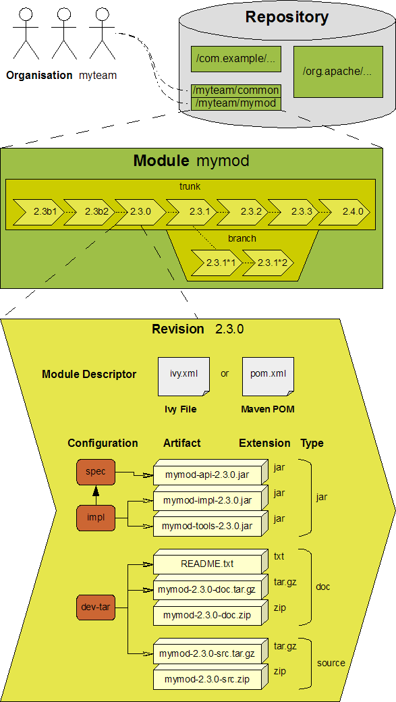

# Ivy Terminology

<!-- TOC -->

- [1. Organisation](#1-organisation)
- [2. Module](#2-module)
  - [2.1. Module Descriptor](#21-module-descriptor)
  - [2.2. Artifact](#22-artifact)
- [3. Module Revision and Status](#3-module-revision-and-status)
  - [3.1. Module revision](#31-module-revision)
  - [3.2. Source revision](#32-source-revision)
  - [3.3. Branch](#33-branch)
  - [3.4. Status of a revision](#34-status-of-a-revision)
- [4. Ivy Settings](#4-ivy-settings)
- [5. Repository](#5-repository)

<!-- /TOC -->



## 1. Organisation

An `organisation` is either a company, an individual, or simply any group of people that produces software. Note that the Ivy `organisation` is very similar to Maven POM `groupId`.

## 2. Module

A `module` is a self-contained, reusable unit of software that, as a whole unit, follows a revision control scheme.

Ivy is only concerned about the **module deliverables** known as `artifacts`, and the **module descriptor** that declares them. These deliverables, for each revision of the module, are managed in repositories. In other words, to Ivy, a module is a chain of revisions each comprising a descriptor and one or more artifacts.

```txt
module = a chain of revisions
a revision = module deliverables(artifacts) + module descriptor(ivy.xml)
```

### 2.1. Module Descriptor

A **module descriptor** is a generic way of identifying what describes a module: **the identifier**<sub>自身标识</sub> (organisation, module name, branch and revision), **the published artifacts**<sub>输出</sub>, **possible configurations**<sub>输入</sub> and **their dependencies**<sub>输入</sub>.

The most common **module descriptors** in Ivy are **Ivy Files**, XML files with an Ivy specific syntax, and usually called `ivy.xml`.

```txt
module descriptors --> ivy.xml
```

But since Ivy is also compatible with Maven 2 metadata format (called POM, for Project Object Model), **POM files** fall into the category of module descriptors.

```txt
module descriptors --> pom.xml
```

And because Ivy accepts pluggable module descriptor parsers, you can use almost whatever you want as module descriptors.

### 2.2. Artifact

An `artifact` is a single file ready for delivery with the publication of a module revision, as a product of development.

## 3. Module Revision and Status

### 3.1. Module revision

A unique revision number or version name is assigned to each delivered unique state of a module. Ivy can help in generating revision numbers for module delivery and publishing revisions to repositories, but other aspects of revision control, especially source revisioning, must be managed with a separate version control system.

### 3.2. Source revision

**Source files** kept under **a version control system** (like Subversion, CVS, SourceSafe, Perforce, etc.) have a separate revisioning scheme that is independent of the **module revisions** visible to Ivy. Ivy is unaware of any revisions of a module’s source files.

### 3.3. Branch

A branch corresponds to the standard meaning of a branch (or sometimes stream) in source control management tools. The head, or trunk, or main stream, is also considered as a branch in Ivy.

### 3.4. Status of a revision

**A module’s status** indicates **how stable a module revision can be considered**. It can be used to consolidate the status of all the dependencies of a module, to prevent the use of an integration revision of a dependency in the release of your module.

**Three statuses** are defined by default in Ivy:

- `integration`: revisions built by a continuous build, a nightly build, and so on, fall in this category
- `milestone`: revisions delivered to the public but not actually finished fall in this category
- `release`: a revision fully tested and labelled fall in this category

## 4. Ivy Settings

**Ivy settings files** are XML files used to **configure** Ivy to indicate **where the modules can be found and how**.

## 5. Repository

What is called a **repository** in Ivy is **a distribution site location** where Ivy is able to find **your required modules' artifacts and descriptors** (i.e. Ivy files in most cases).
